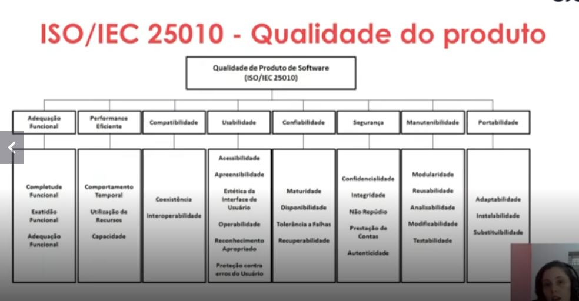

# O que é Qualidade de Software

A qualidade de software é um conceito fundamental no desenvolvimento de sistemas, sendo definida por diversas normas e literaturas especializadas.

## Definindo Qualidade

De acordo com as principais referências da área:

*   **NBR/ISO 9000:2005**: Grau no qual um conjunto de características inerentes satisfaz a requisitos.
*   **ISO/IEC 25010:2011**: "Capacidade do produto de software de satisfazer necessidades declaradas e implícitas sob condições especificadas".
*   **IEEE Standard (2014)**: "O grau em que um produto de software atende aos requisitos estabelecidos; no entanto, a qualidade depende do grau em que esses requisitos representam com precisão as necessidades, desejos e expectativas das partes interessadas".

### Aspectos Importantes

1.  **Requisitos de software** são a base para medir a qualidade.
2.  **Padrões especificados** definem o conjunto de critérios de desenvolvimento.
3.  Existem **requisitos implícitos** que, embora não mencionados, afetam diretamente a qualidade percebida.

