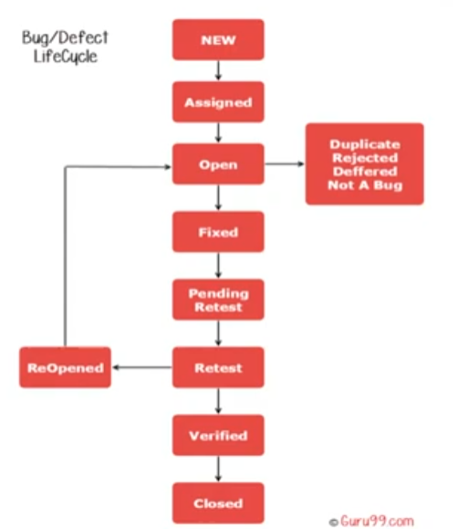

# Caracterizando Defeitos e Bugs

O rastreamento de defeitos é essencial para entender o produto, facilitar correções e alinhar o time de desenvolvimento.

## Definições Importantes

*   **Erro**: Ação humana que produz um resultado incorreto.
*   **Defeito**: Imperfeição ou deficiência relacionada aos requerimentos e especificações.
*   **Falha do Sistema**: Evento no qual o sistema não executa uma função sob limites específicos.

## Ciclo de Vida do Bug

O fluxo típico de um defeito no sistema de rastreamento:

1.  **New**: Identificado e cadastrado.
2.  **Assigned**: Atribuído a um desenvolvedor.
3.  **Open**: Em análise/correção.
4.  **Fixed**: Correção finalizada.
5.  **Pending Retest**: Aguardando o time de teste.
6.  **Retest**: Execução do reteste.
7.  **Verified**: Defeito corrigido e validado.
8.  **Reopen**: Defeito não foi corrigido corretamente.
9.  **Closed**: Corrigido, testado e aprovado.

*Estados especiais: Duplicate, Rejected, Deferred, Not a bug.*

## Reporte de Defeito (Informações Essenciais)

*   **Identificador Único**: Ex: BUG-123.
*   **Título**: Resumo claro.
*   **Ambiente**: SO, navegador, versão, etc.
*   **Descrição**: Passos detalhados para reprodução.
*   **Evidências**: Logs, screenshots, vídeos.
*   **Impacto**: Severidade e Prioridade.

## Ferramentas de Suporte

Algumas das ferramentas mais utilizadas no mercado:
*   **Jira** (Líder em métodos ágeis)
*   **Bugzilla** (Gratuita)
*   **Azure DevOps** (Plataforma completa)
*   **MantisBT** (Simples e gratuita)
*   **Trello/Asana** (Adaptáveis para bugs simples)
